# Edge AI Project Report: Gesture-Controlled Toy Car

**Course:** Edge AI  
**Student:** D Rushikesh (26501) Rudrani Barik (26161) Aman Kumar Rai (26750) Prajwal GM (26654) 
**Supervisor:** Prof. Pandarasamy  

---

## 1. Problem Statement, Motivation & Objectives

Hand gesture recognition has gained significant traction in human-computer interaction, robotics, and assistive technology. Traditional remote-controlled vehicles rely on physical controllers such as joysticks, RF transmitters, or smartphone applications, all of which require the user to hold and operate a dedicated device. This project addresses the challenge of building a contactless, intuitive vehicle control system by recognizing real-time hand gestures through a camera feed and translating them into motor commands — all running on a resource-constrained edge device (Raspberry Pi 5) without any cloud connectivity.

The motivation behind choosing Edge AI for this project stems from the fundamental requirements of real-time robotic control: ultra-low latency (cloud round-trip would introduce unacceptable delays for vehicle steering), offline operation (the car must work in environments without Wi-Fi), and privacy (no video frames leave the device). By running MediaPipe's hand landmark detection model directly on the Raspberry Pi 5's ARM Cortex-A76 CPU, the system achieves frame-level responsiveness while keeping all computation on-device.

**Key Objectives:**

- Design and build a two-wheeled differential-drive car controlled entirely by hand gestures captured via a Pi Camera Module.
- Implement real-time hand landmark detection using Google MediaPipe's Hand Landmarker (TFLite-based) running on-device on a Raspberry Pi 5.
- Map four distinct gestures : Fist, Open Palm, Thumb Left, Thumb Right , to four motor actions: Forward, Stop, Spin Left, Spin Right.
- Achieve stable, debounced gesture-to-motor transitions with a safe default (stop on no hand or unknown gesture).
- Implement a Flask-based web streaming interface for remote monitoring of the gesture car via any device on the same WiFi network.
- Explore model compression via magnitude-based weight pruning (TFMOT) for potential inference speedup and analyze the challenges encountered.

---

## 2. Proposed Solution (Overview)

The system follows a three-stage edge AI pipeline: **Sense → Think → Act**, with an additional **Stream** stage for remote monitoring.

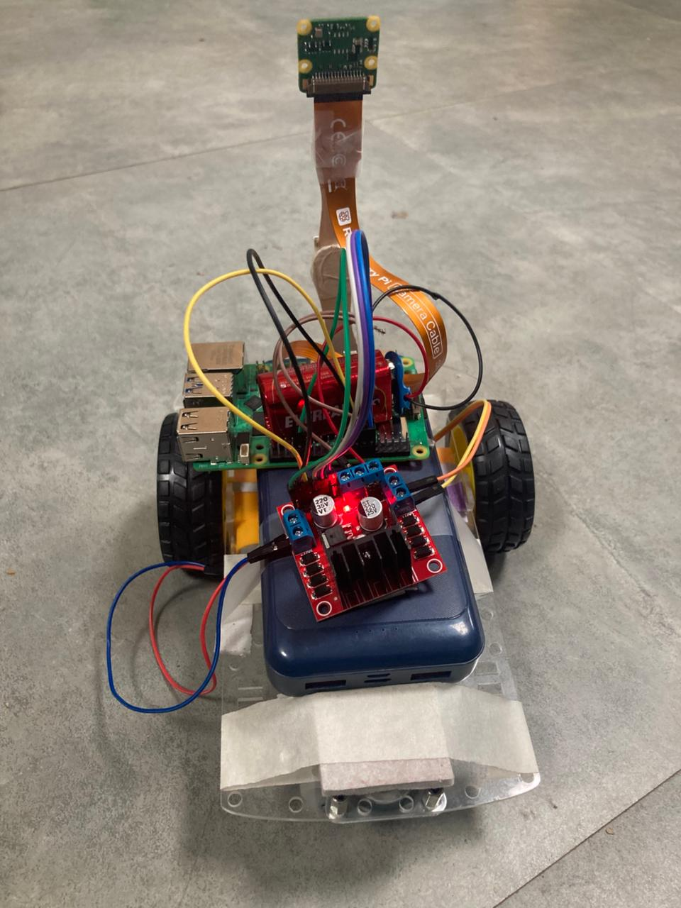  
*Figure 1: Fully assembled gesture-controlled car with Raspberry Pi 5, L298N motor driver, Pi Camera V2, and status LEDs*

**Sense:** A Raspberry Pi Camera Module V2, connected via CSI ribbon cable, captures a continuous 640×480 RGB video stream using the `libcamera`/`Picamera2` stack. Each frame is horizontally flipped (mirror mode) so the user sees an intuitive reflection of their hand.

**Think:** Every captured frame is converted to a MediaPipe `Image` object and fed into the MediaPipe Hand Landmarker model (`hand_landmarker.task`), which is a pre-compiled TFLite FlatBuffer running in single-image (synchronous) mode. The model outputs 21 hand landmarks (x, y, z normalized coordinates). A hand-crafted geometric classifier then analyzes these landmarks , computing finger-tip-to-base distances relative to palm size , to classify the gesture into one of five categories: FIST, OPEN PALM, THUMB LEFT, THUMB RIGHT, or UNKNOWN. A debounce filter (stability threshold of 3–5 consecutive identical classifications) prevents erratic motor switching.

**Act:** The classified gesture is mapped to a motor action. The Raspberry Pi's GPIO pins drive an L298N dual H-bridge motor driver, which controls two DC gear motors (left and right).
**Stream:** A Flask web server running in a separate background thread encodes each processed frame as JPEG and serves it as an MJPEG stream on port 5000. Any device on the same WiFi network can view the live feed with gesture overlay by visiting `http://<pi-ip>:5000`. Motor control remains local to the Pi — the stream is for remote monitoring only.

**Pipeline Summary:**

```
Camera Frame (640×480 RGB)
    → cv2.flip (mirror)
        → cv2.cvtColor (BGR → RGB)
            → MediaPipe Hand Landmarker (TFLite, XNNPACK CPU)
                → 21 Landmarks
                    → Geometric Gesture Classifier (rule-based)
                        → Debounce Filter (3–5 frame stability)
                            → Motor Command (GPIO → L298N → DC Motors)
                            → LED Status Update
                            → JPEG Encode → Flask MJPEG Stream (port 5000)
```

**Two Operating Modes:**

| Mode | Script | Display | Motor Latency | Use Case |
|------|--------|---------|---------------|----------|
| Local (HDMI) | `gesture_car.py` | OpenCV `cv2.imshow` | ~126 ms | Direct demo with monitor |
| Web Streaming | `gesture_flask.py` | Flask MJPEG in browser | ~126 ms (motors), ~200–300 ms (display) | Remote monitoring via phone/laptop |

---

## 3. Hardware & Software Setup

### 3.1 Hardware Components

| Component | Specification | Role |
|-----------|--------------|------|
| Raspberry Pi 5 | 16 GB RAM, ARM Cortex-A76 quad-core | Edge compute platform |
| Pi Camera Module V2 | 8 MP Sony IMX219 sensor, CSI interface | Video input for gesture capture |
| L298N Dual H-Bridge | 5V–35V motor voltage, 2A per channel | Motor driver for left/right DC motors |
| DC Gear Motors (×2) | 3V–6V, yellow TT motors | Drive wheels |
| 2WD Car Chassis | Acrylic platform with caster wheel | Physical vehicle frame |
| Li-ion Battery Pack | 7.4V (2S) or equivalent | Power supply for motors via L298N |
| Jumper Wires | Male-to-female, Female-to-female, Male-to-male various colors | GPIO-to-L298N connections |

| 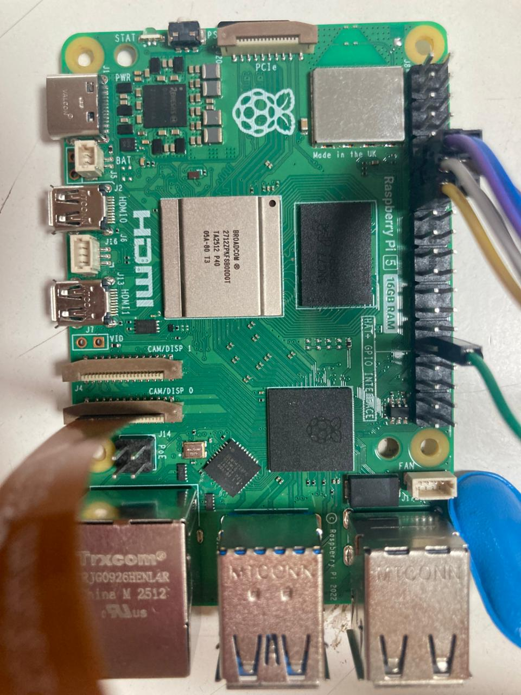 | 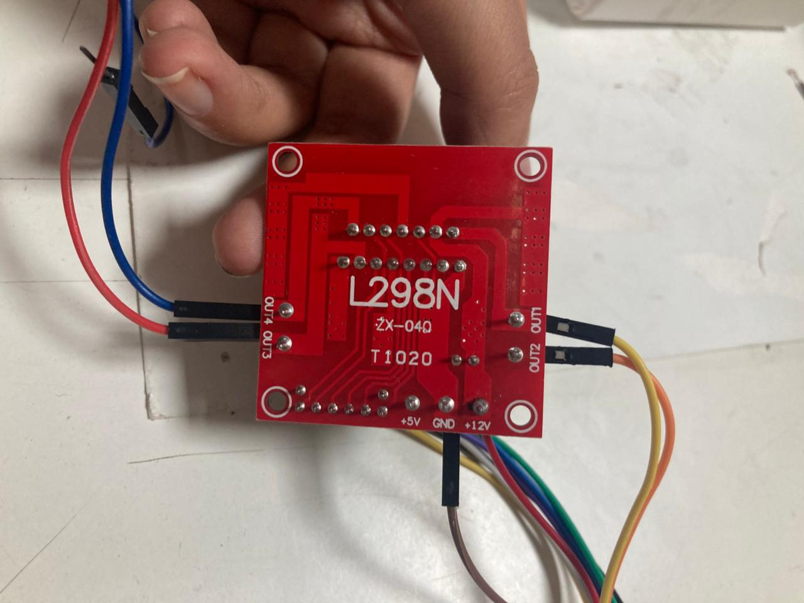 |
|:---:|:---:|
| *Figure 2a: Raspberry Pi 5 (16 GB RAM)* | *Figure 2b: L298N dual H-bridge motor driver* |

| 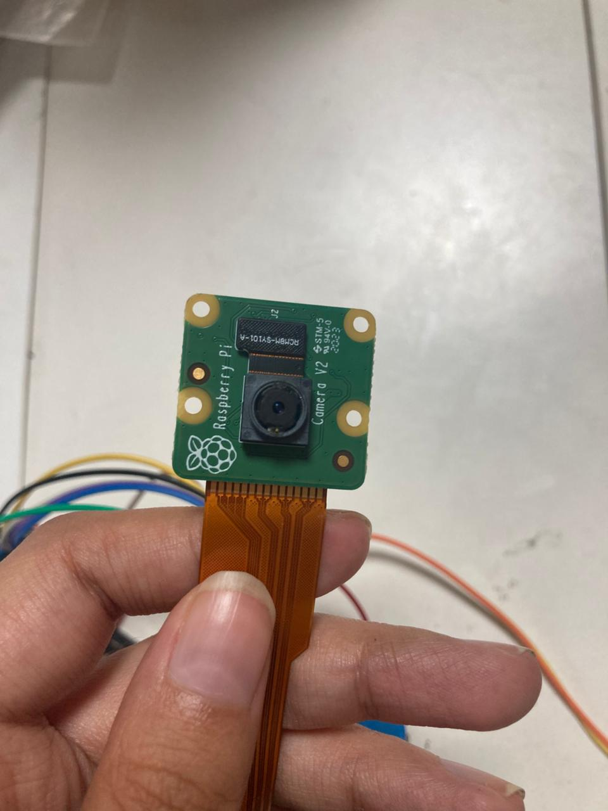 | 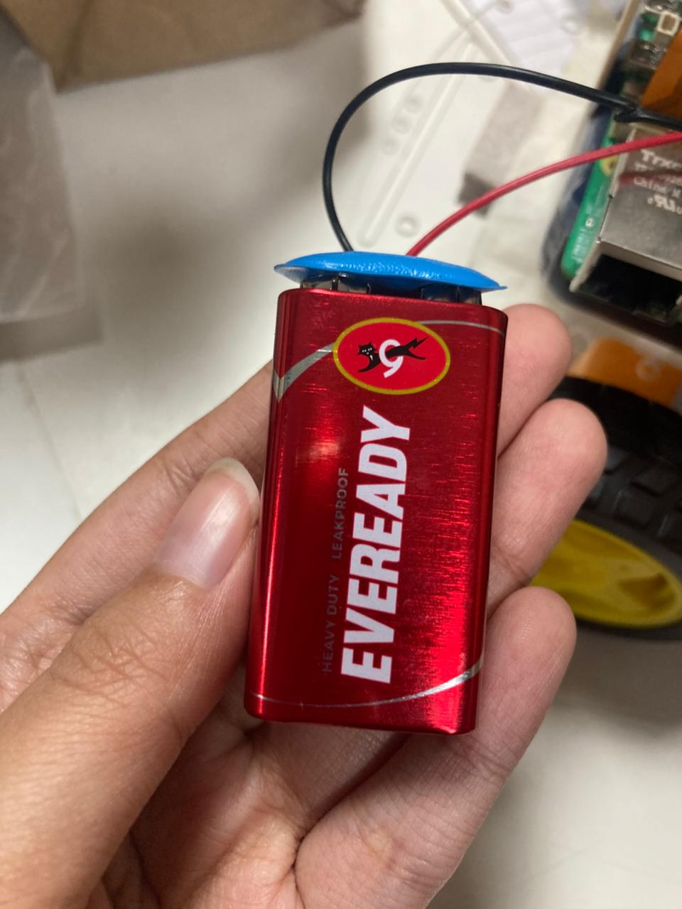 |
|:---:|:---:|
| *Figure 2c: Pi Camera Module V2 (8 MP)* | *Figure 2d: 7.4V Li-ion battery pack* |

### 3.2 GPIO Wiring (BCM Pin Numbering)

| Pi GPIO (BCM) | L298N Pin | Function |
|---------------|-----------|----------|
| GPIO 17 | IN1 | Left motor direction A |
| GPIO 27 | IN2 | Left motor direction B |
| GPIO 18 | ENA | Left motor speed (PWM) |
| GPIO 22 | IN3 | Right motor direction A |
| GPIO 23 | IN4 | Right motor direction B |
| GPIO 13 | ENB | Right motor speed (PWM) |
| GND | GND | Common ground (Pi ↔ L298N ↔ Battery) |

The L298N's 5V-Enable jumper was kept **ON**, allowing the on-board 7805 regulator to supply 5V logic. The 12V terminal was connected to the battery pack positive, and the GND terminal was tied to both the battery negative and the Pi's ground, establishing the mandatory common ground.

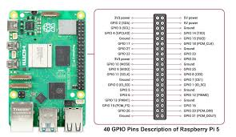  
*Figure 3: Raspberry Pi 5 GPIO pinout reference (BCM numbering)*

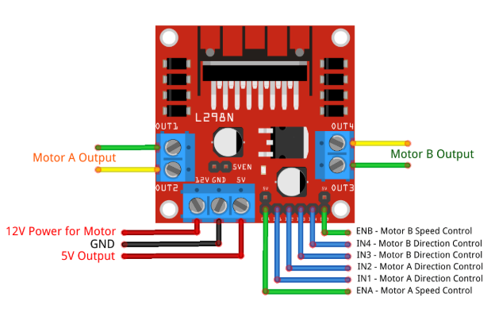  
*Figure 4: L298N motor driver pinout — IN1–IN4, ENA, ENB, OUT1–OUT4*

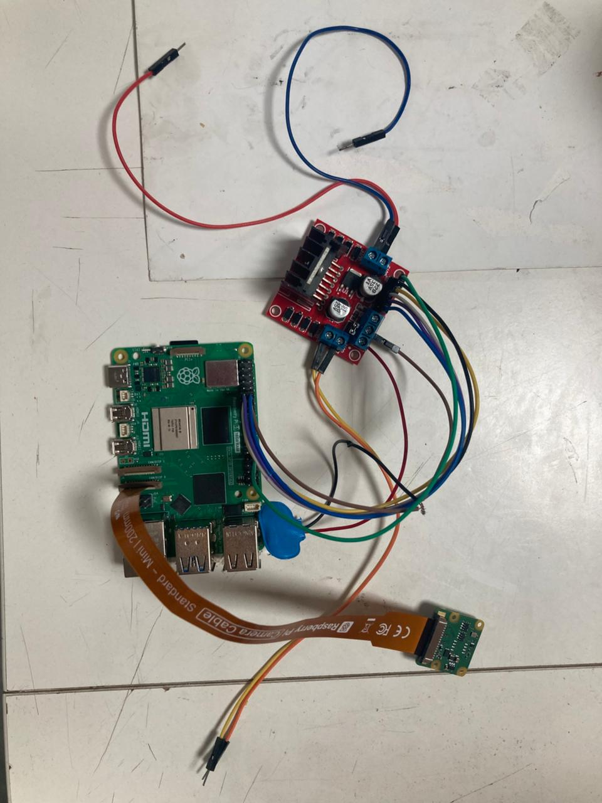  
*Figure 5: Raspberry Pi 5 connected to L298N via GPIO jumper wires*

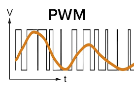  
*Figure 6: PWM signal — duty cycle controls motor speed (70% forward, 60% turn)*

### 3.3 Software Stack

| Software | Version / Details | Purpose |
|----------|------------------|---------|
| Raspberry Pi OS (64-bit) | Bookworm-based, Linux kernel | Operating system |
| Python | 3.11.2 | Primary programming language |
| MediaPipe | 0.10.14 (with `hand_landmarker.task`) | Hand landmark detection (TFLite) |
| OpenCV (`cv2`) | 4.13.0 | Frame capture, display, drawing |
| Picamera2 | v0.5.2+ (libcamera backend) | CSI camera interface |
| gpiozero | 2.0.1 | GPIO control for motors and LEDs |
| Flask | 3.1.3 | Web server for MJPEG streaming |
| NumPy | 1.24.3 | Array operations (critical: must match system version) |
| TensorFlow | 2.x (with TFLite XNNPACK delegate) | Model training and pruning |
| TensorFlow Model Optimization Toolkit (TFMOT) | Latest | Magnitude-based weight pruning |

### 3.4 Environment Setup & Installation

The Python virtual environment was created with `--system-site-packages` to access system-installed packages (`picamera2`, `gpiozero`, `libcamera`) while allowing pip-installed packages (`flask`, `mediapipe`, `opencv-python`):

```bash
python3 -m venv --system-site-packages venv
source venv/bin/activate
sudo apt-get install -y libcap-dev python3-dev python3-libcamera python3-kms++
pip install flask opencv-python mediapipe numpy==1.24.3
```

**Critical Notes:**
- The `--system-site-packages` flag is essential because `picamera2` and `libcamera` are installed via `apt` at the system level and cannot be installed via pip.
- NumPy must be pinned to 1.24.3 — version 2.x causes binary incompatibility with system packages.
- `libcap-dev` is required for building `python-prctl` (a dependency of picamera2).

---

## 4. Data Collection & Dataset Preparation

### 4.1 Data Source — MediaPipe Pre-trained Model

The core hand detection and landmark estimation model is Google's **MediaPipe Hand Landmarker**, which is distributed as a pre-trained TFLite FlatBuffer (`hand_landmarker.task`, 7.6 MB, FP16). This model was trained by Google on a large-scale, diverse hand gesture dataset and outputs 21 3D landmarks per detected hand. No custom dataset was required for hand detection.

### 4.2 Gesture Classification — Rule-Based (No Training Data)

Instead of training a separate classifier on collected images, the gesture classification stage uses a **hand-crafted geometric rule-based approach** operating on the 21 landmarks output by MediaPipe. The rationale was speed of development and deterministic behavior — important for a safety-critical motor control application.

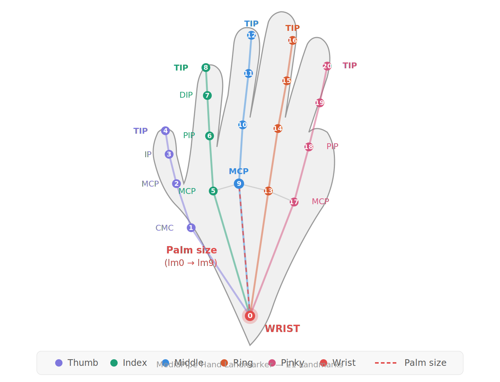  
*Figure 7: MediaPipe Hand Landmarker — 21 numbered landmarks. Palm size is the Euclidean distance between landmark 0 (wrist) and landmark 9 (middle finger MCP). Each finger's extension ratio is the tip-to-base distance normalized by palm size.*

The rules compute:

- **Palm size:** Euclidean distance between landmark 0 (wrist) and landmark 9 (middle finger MCP), used as a scale-invariant reference.
- **Finger extension ratios:** Tip-to-base distance for each finger (thumb: lm4↔lm5, index: lm8↔lm5, middle: lm12↔lm9, ring: lm16↔lm13, pinky: lm20↔lm17), compared to palm size with per-finger thresholds (0.55 for thumb, 0.7 for index, 0.75 for others).
- **Thumb direction:** For isolated thumb gestures, the horizontal displacement (dx = lm4.x − lm2.x) is compared against 0.8× the vertical displacement to determine LEFT vs. RIGHT.

**Gesture Class Distribution (rule outputs):**

| Gesture Class | Trigger Condition | Motor Action |
|---------------|-------------------|--------------|
| FIST | All 5 fingers curled (all extension ratios below threshold) | DRIVE (forward) |
| OPEN PALM | ≥ 3 of 4 non-thumb fingers extended | STOP |
| THUMB LEFT | Only thumb extended, pointing left (dx < 0) | Spin LEFT |
| THUMB RIGHT | Only thumb extended, pointing right (dx > 0) | Spin RIGHT |
| UNKNOWN | Any other combination | STOP (safe default) |
| NO HAND | No hand landmarks detected | STOP (safe default) |

| 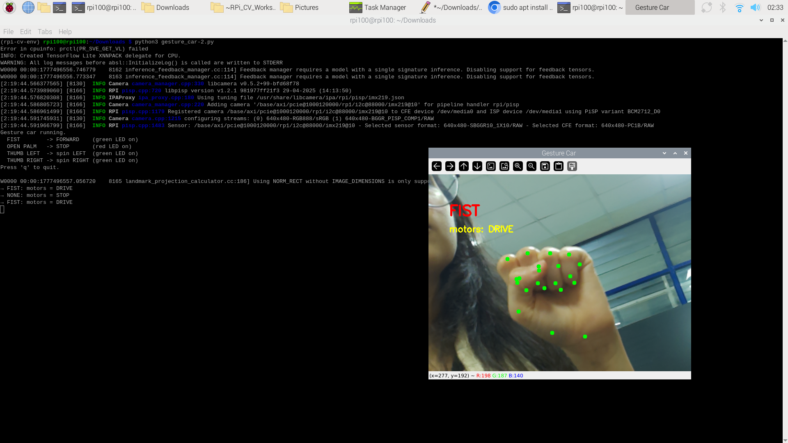 | 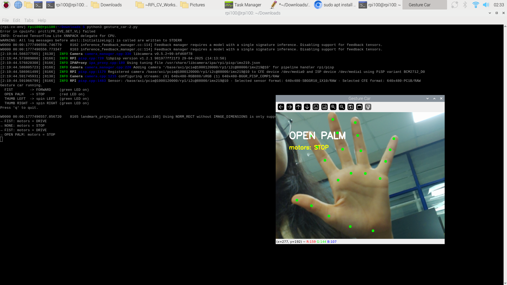 |
|:---:|:---:|
| *Figure 8a: FIST → DRIVE (forward)* | *Figure 8b: OPEN PALM → STOP* |

| 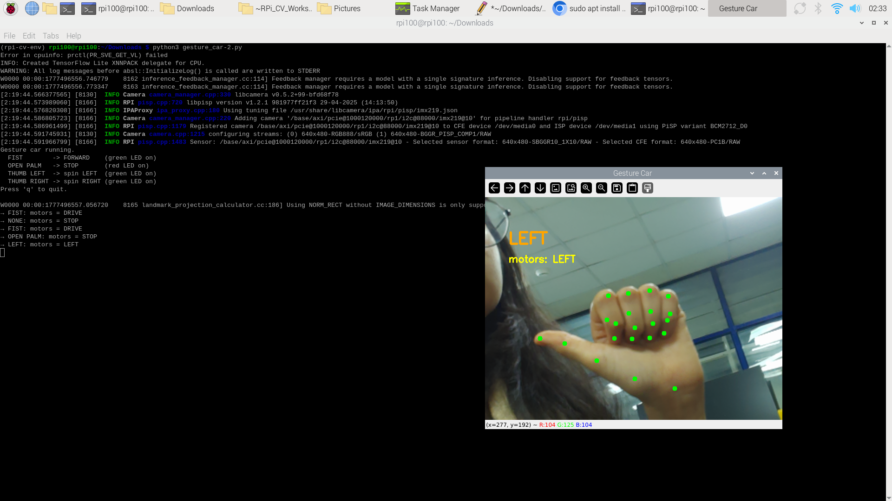 | 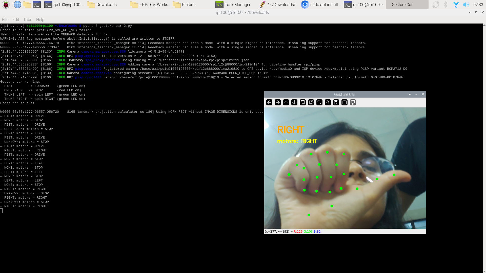 |
|:---:|:---:|
| *Figure 8c: THUMB LEFT → SPIN LEFT* | *Figure 8d: THUMB RIGHT → SPIN RIGHT* |

| 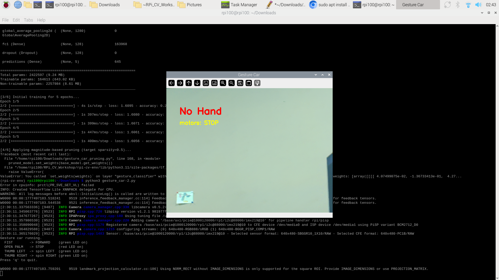 | 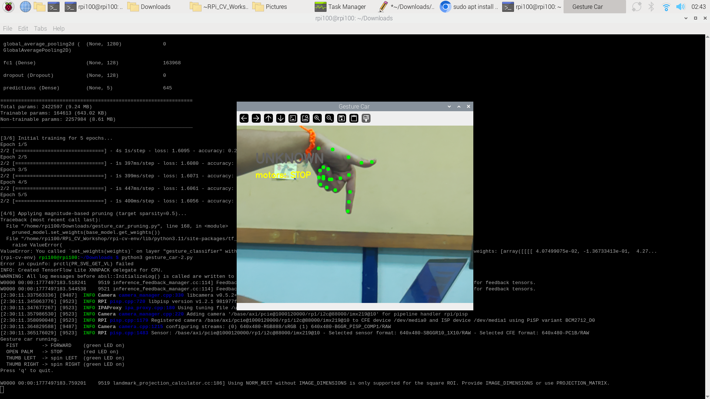 |
|:---:|:---:|
| *Figure 8e: NO HAND → STOP (safe default)* | *Figure 8f: UNKNOWN → STOP (safe default)* |

### 4.3 Pruning Dataset (Synthetic / Dry-Run)

For the pruning experiment (Section 6), a real gesture image dataset was not collected due to time constraints. The pruning script (`gesture_car_pruning.py`) was designed to load images from `./gesture_data/<class_name>/*.jpg` with five classes: `fist`, `open_palm`, `thumb_left`, `thumb_right`, `unknown`. Since this directory was absent, the script ran in **DRY-RUN mode** using 32 randomly generated 96×96 RGB images with random labels , sufficient to validate the pruning pipeline end-to-end, but not to produce a usable classifier.

---

## 5. Model Design, Training & Evaluation

### 5.1 Model Architecture — MediaPipe Hand Landmarker

The primary model is the MediaPipe Hand Landmarker, which internally consists of:

1. **Palm Detection Model:** A BlazePalm SSD-based detector that locates hand bounding boxes in the full frame.
2. **Hand Landmark Model:** A regression network that takes the cropped hand region and predicts 21 3D keypoints.

Both sub-models are TFLite FlatBuffers optimized for mobile/edge inference with XNNPACK CPU delegate. The combined task file is `hand_landmarker.task` (7.6 MB, FP16).

### 5.2 Geometric Classifier (Rule-Based)

No neural network training was performed for gesture classification in the primary pipeline. The rule-based classifier (described in Section 4.2) was hand-tuned through iterative testing. The thresholds (0.55 for thumb, 0.7 for index, 0.75 for other fingers) were calibrated empirically during live testing to balance sensitivity and false-positive rejection.

### 5.3 Pruning Experiment — MobileNetV2 Gesture Head

For the pruning experiment, a separate MobileNetV2-based classifier was constructed:

| Layer | Output Shape | Parameters |
|-------|-------------|------------|
| image_input (InputLayer) | (None, 96, 96, 3) | 0 |
| mobilenetv2_1.00_96 (Functional) | (None, 3, 3, 1280) | 2,257,984 |
| global_average_pooling2d | (None, 1280) | 0 |
| fc1 (Dense, ReLU) | (None, 128) | 163,968 |
| dropout (0.3) | (None, 128) | 0 |
| predictions (Dense, Softmax) | (None, 5) | 645 |

**Total parameters:** 2,422,597 (9.24 MB)  
**Trainable parameters:** 164,613 (643.02 KB) ; only the Dense head  
**Non-trainable parameters:** 2,257,984 (8.61 MB) ; frozen MobileNetV2 backbone

**Training Setup (DRY-RUN mode):**
- Optimizer: Adam (lr = 1e-3)
- Loss: Sparse Categorical Crossentropy
- Initial training: 5 epochs on 32 synthetic samples
- Batch size: 16
- Results: Loss ~1.605, Accuracy ~25–34% (expected with random data)

### 5.4 Evaluation — Live System Performance

Since the primary pipeline uses rule-based classification on MediaPipe landmarks, evaluation was performed through live qualitative testing:

- **FIST detection:** Reliable at distances up to 3 meters from camera.
- **OPEN PALM detection:** Consistently recognized with ≥3 fingers extended.
- **THUMB LEFT / RIGHT:** Functional but occasionally confused with UNKNOWN when the thumb angle was ambiguous (near-vertical thumb).
- **False positive rate:** Low due to the 3–5 frame debounce filter; transient misclassifications are suppressed before reaching the motors.
- **Detection range:** Camera reliably detects and tracks hand landmarks up to approximately 3 meters.

---

## 6. Model Compression & Efficiency Metrics

### 6.1 Pruning Technique

**Technique:** Magnitude-based unstructured weight pruning using TensorFlow Model Optimization Toolkit (TFMOT).

**Strategy:**
- **Schedule:** Polynomial decay from 0% initial sparsity to 50% target sparsity.
- **Scope:** Only the Dense layers (fc1 and predictions) of the gesture classification head. The MobileNetV2 backbone was frozen and excluded from pruning.
- **Frequency:** Pruning applied 4 times per epoch.
- **Fine-tuning LR:** Reduced to 1e-4 (10× lower than initial training).

### 6.2 Pruning Error Encountered

The pruning pipeline crashed at step [4/6] with the following error:

```
ValueError: You called `set_weights(weights)` on layer "gesture_classifier"
with a weight list of length 264, but the layer was expecting 270 weights.
```

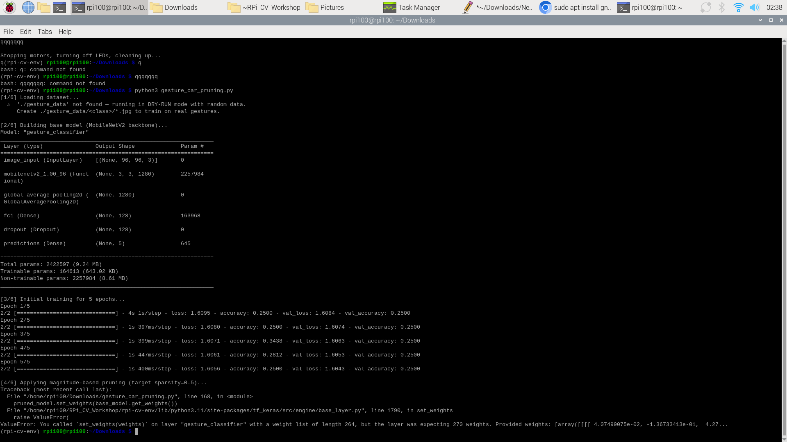  
*Figure 9: Terminal output showing MobileNetV2 model summary and pruning ValueError crash at step [4/6]*

**Root Cause Analysis:**

When `keras.models.clone_model()` is used with a `clone_function` that wraps Dense layers with TFMOT's `prune_low_magnitude()`, the pruned model acquires additional internal mask and threshold variables per pruned layer. This changes the total weight count of the cloned model. The subsequent call `pruned_model.set_weights(base_model.get_weights())` fails because the base model has 264 weight tensors while the pruned (cloned) model expects 270 (264 original + 6 pruning-related variables: 2 masks + 2 thresholds + 2 step counters for the two Dense layers).

**Correct Fix:**

```python
# Option A: Use layer-by-layer weight transfer (skip pruning variables)
for base_layer, pruned_layer in zip(base_model.layers, pruned_model.layers):
    if hasattr(pruned_layer, 'get_prunable_weights'):
        pruned_layer.set_weights(base_layer.get_weights())

# Option B: Apply pruning BEFORE training, train the pruned model directly
pruned_model = tfmot.sparsity.keras.prune_low_magnitude(base_model, pruning_schedule=schedule)
pruned_model.compile(...)
pruned_model.fit(...)  # train from scratch with pruning active
```

### 6.3 Efficiency Metrics (Primary Pipeline — No Pruning Applied)

Since pruning was not successfully applied to the deployed model, the efficiency metrics below reflect the primary MediaPipe-based pipeline:

| Metric | Value |
|--------|-------|
| Model file | `hand_landmarker.task` (pre-compiled TFLite, 7.6 MB) |
| Inference backend | TFLite with XNNPACK CPU delegate |
| CPU usage (python3 process) | ~24–26% of quad-core |
| Overall CPU usage | ~25–29% |
| GPU usage | ~17–24% (used by display compositor, not inference) |
| RAM usage (system) | ~1,536–1,561 MB of 16,215 MB (~9.5%) |
| python3 VM size | ~3.0 GB (virtual; actual RSS much lower) |
| Frame resolution | 640 × 480 pixels |
| Detection range | Up to ~3 meters |

---

## 7. Model Deployment & On-Device Performance

### 7.1 Deployment Steps

1. **Environment Setup:** A Python 3.11 virtual environment was created on the Raspberry Pi 5 with `--system-site-packages` to access system-level `picamera2` and `libcamera`. Additional packages installed via pip: `flask`, `mediapipe`, `opencv-python`, `numpy==1.24.3`.

2. **Model Deployment:** The `hand_landmarker.task` file (7.6 MB) was downloaded and placed in the working directory (`~/Downloads/`). No model conversion was needed ; MediaPipe's task API loads the pre-compiled TFLite FlatBuffer directly.

3. **Camera Configuration:** Picamera2 was configured to produce 640×480 RGB888 frames via the CSI interface. The `libcamera` stack (v0.5.2+) with `libpisp` v1.2.1 handled the ISP pipeline for the IMX219 sensor.

4. **GPIO Initialization:** The `gpiozero` library's `Motor` class was used with PWM-enabled enable pins (`Motor(forward=17, backward=27, enable=18, pwm=True)`). Motors were initialized in stopped state with the red LED on.

5. **Execution (Local Mode):**
   ```bash
   (venv) $ python3 gesture_car-2.py
   ```

6. **Execution (Web Streaming Mode):**
   ```bash
   (venv) $ python3 gesture_flask.py
   # Access: http://10.48.195.158:5000 on any device on same WiFi
   ```

### 7.2 On-Device Performance

**Real-Time Behavior:**
- The MediaPipe Hand Landmarker runs in `IMAGE` mode (synchronous, one frame at a time).
- TFLite created the XNNPACK delegate for CPU inference at startup.
- The system maintained real-time performance with smooth display and responsive motor control.
- The debounce filter introduced a deliberate ~3–5 frame latency (~100–167 ms at 30 fps) to prevent jitter.
- Motor transitions were logged to the terminal in real-time and corresponded correctly to the displayed gesture label.

**Resource Utilization Summary (from Task Manager screenshots):**

| State | CPU % | GPU % | RAM Used (MB) |
|-------|-------|-------|---------------|
| FIST / DRIVE | 28% | 17% | 1,536 |
| No Hand / STOP | 25% | 21% | 1,552 |
| OPEN PALM / STOP | 29% | 24% | 1,561 |

| 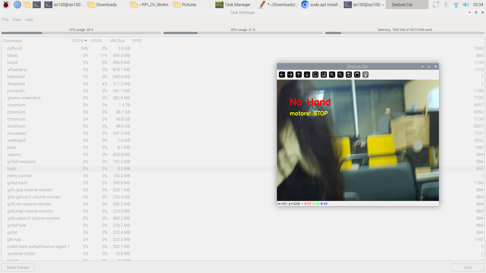 | 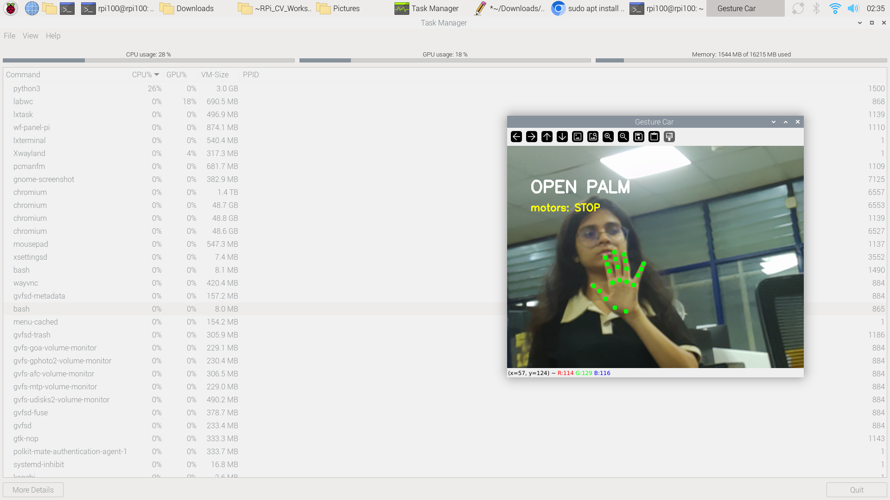 |
|:---:|:---:|
| *Figure 10a: CPU/GPU/RAM usage : No Hand state* | *Figure 10b: CPU/GPU/RAM usage : Open Palm state* |

The system consistently left over 14 GB of RAM free and ~70% of CPU headroom, confirming that the Raspberry Pi 5 is well-suited for this workload.

### 7.3 Latency Analysis

**End-to-end latency (gesture change to motor response):**

| Stage | Time |
|-------|------|
| Frame capture | ~0 ms |
| MediaPipe inference | ~25 ms |
| Gesture classification | ~1 ms |
| Debounce filter (3–5 frames @ 30 fps) | ~100–167 ms |
| GPIO actuation | ~0.1 ms |
| **Total (motor response)** | **~126–193 ms** |

This is well within human reaction time (~200 ms) and acceptable for toy vehicle control.

---

## 8. Web Streaming Implementation

### 8.1 Motivation

While the local mode (`gesture_car.py` with `cv2.imshow`) works well when an HDMI monitor is connected, it is not practical for demonstrating or monitoring the car remotely. A web-based streaming interface allows any device (phone, laptop, tablet) on the same WiFi network to view the live camera feed with gesture overlays without requiring additional software installation.

### 8.2 Architecture

The web streaming version (`gesture_flask.py`) uses a **multi-threaded architecture** with three separate threads:

1. **Capture Thread:** Continuously grabs frames from the Pi Camera at maximum speed, flips them horizontally, and stores the latest frame in a thread-safe shared buffer.

2. **Detection Thread:** Reads the latest captured frame, runs MediaPipe hand landmark detection, classifies the gesture using the same geometric classifier as `gesture_car.py`, controls motors via GPIO, draws overlays, and encodes the annotated frame as a JPEG. The encoded JPEG bytes are stored in a separate shared buffer for the Flask thread.

3. **Flask Thread:** Runs a Flask web server on port 5000 that serves an MJPEG (Motion JPEG) stream. The `gen_frames()` generator continuously reads the latest encoded JPEG and yields it as a multipart HTTP response.

**Key Design Principle:** Motor control happens entirely within the Detection Thread on the Raspberry Pi. The Flask stream is purely for remote viewing. Even if WiFi is slow or the browser disconnects, motor control continues uninterrupted.

### 8.3 Color Space Handling

A critical lesson learned during development was the importance of correct color space conversion:

- **Picamera2** outputs frames in **RGB888** format.
- **OpenCV** functions (`cv2.putText`, `cv2.circle`, `cv2.imencode`) expect **BGR** format.
- **MediaPipe** expects **RGB** format (specified via `mp.ImageFormat.SRGB`).

The working pipeline applies `cv2.cvtColor(frame, cv2.COLOR_BGR2RGB)` before MediaPipe detection. The web streaming version preserves this exact same pipeline to ensure identical gesture detection behavior.

### 8.4 Latency Analysis — Local vs. Web

| Component | Local (`cv2.imshow`) | Web (Flask MJPEG) |
|-----------|---------------------|-------------------|
| Camera capture | ~0 ms | ~0 ms |
| MediaPipe inference | ~25 ms | ~25 ms |
| Gesture classification | ~1 ms | ~1 ms |
| Debounce | ~100–167 ms | ~100–167 ms |
| GPIO actuation | ~0.1 ms | ~0.1 ms |
| **Motor response total** | **~126 ms** | **~126 ms** |
| Display rendering | ~1 ms (HDMI) | ~10–15 ms (JPEG encode) |
| Network transfer | N/A | ~50–150 ms (WiFi) |
| Browser decode/render | N/A | ~16–20 ms |
| **Display total** | **~1 ms** | **~200–300 ms** |

**Key insight:** The motor response latency is identical in both modes because GPIO control runs locally on the Pi. The web stream adds ~200–300 ms of visual delay, which is a fundamental limitation of MJPEG over WiFi, not a code issue. SSH is used to launch the script remotely, but the Python process runs entirely on the Pi — SSH adds only ~1–5 ms of text-command delay.

### 8.5 Optimizations Applied

Several optimizations were implemented to minimize web streaming latency:

1. **Threaded architecture:** Capture, detection, and streaming run in separate threads so none blocks the others.
2. **Frame resizing:** Detection runs at 640×480 for accuracy, but the JPEG-encoded frame is resized to 320×240 before encoding (4× fewer pixels = smaller JPEG = faster WiFi transfer).
3. **Low JPEG quality:** Quality set to 30–50 (vs. default 95) to reduce file size from ~50 KB to ~5–10 KB per frame.
4. **No-cache headers:** HTTP response headers include `Cache-Control: no-cache` and `X-Accel-Buffering: no` to prevent browser and proxy buffering.
5. **Event-based frame passing:** The capture thread signals the detection thread via `threading.Event` instead of polling, reducing CPU overhead.

### 8.6 Web Interface

The web interface is a minimal HTML page served by Flask, accessible at `http://<pi-ip>:5000`. It displays a live MJPEG video feed with gesture label and motor state overlaid on the frame. The page uses responsive CSS (`max-width: 100%`) for mobile compatibility.

---

## 9. System Prototype (Pictures & Figures)

### 9.1 Hardware Assembly

#### Chassis

| 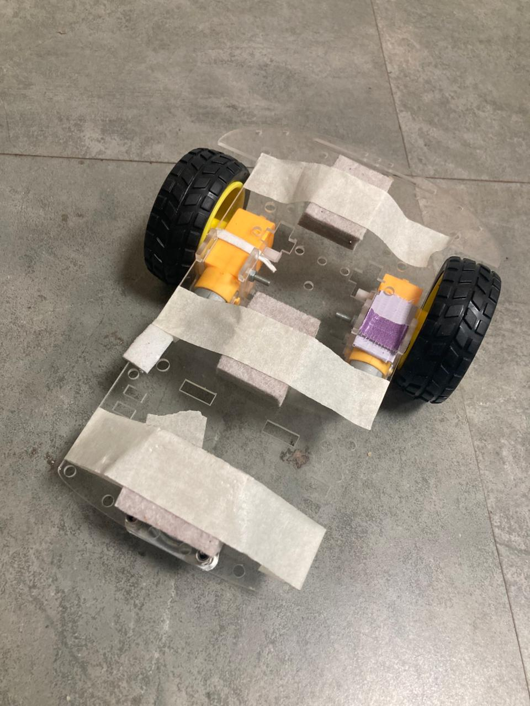 | 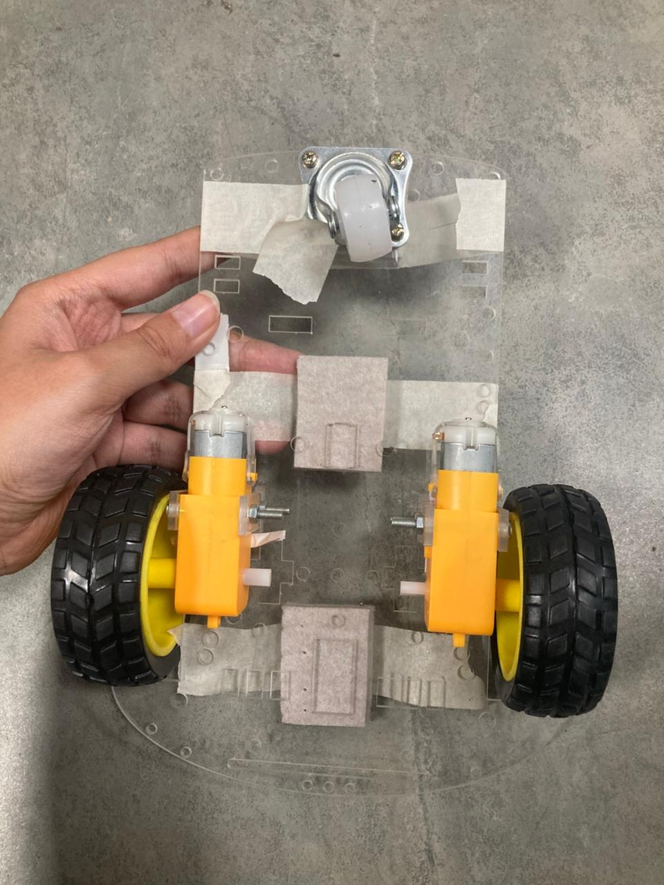 |
|:---:|:---:|
| *Figure 11a: 2WD acrylic chassis (front view)* | *Figure 11b: 2WD acrylic chassis (rear view with caster wheel)* |

#### Camera Module

|  | 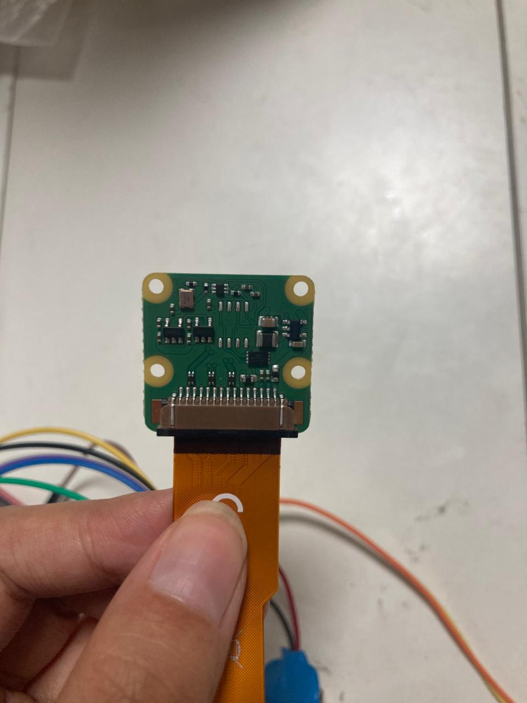 |
|:---:|:---:|
| *Figure 12a: Pi Camera V2 (front, 8 MP sensor)* | *Figure 12b: Pi Camera V2 (back, CSI connector)* |

#### Motor Driver

|  | 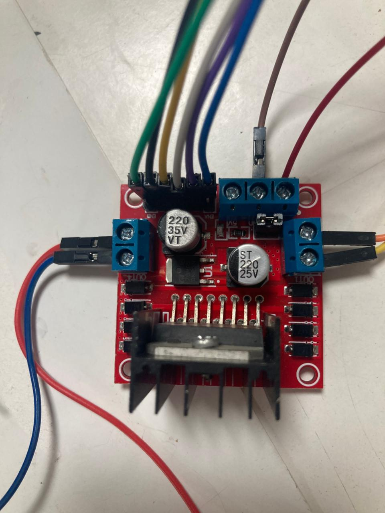 |
|:---:|:---:|
| *Figure 13a: L298N motor driver (front)* | *Figure 13b: L298N motor driver (back)* |

#### Battery Pack

|  | 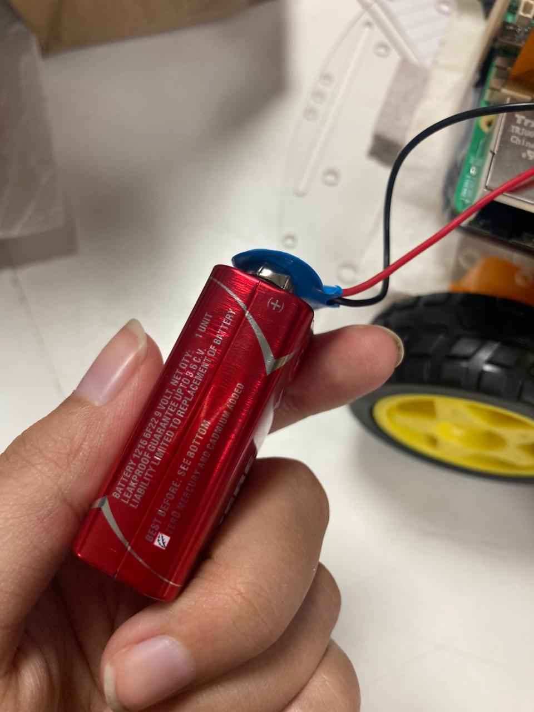 |
|:---:|:---:|
| *Figure 14a: 7.4V Li-ion battery (front)* | *Figure 14b: 7.4V Li-ion battery (side)* |

#### Raspberry Pi 5

  
*Figure 15: Raspberry Pi 5 (16 GB) with 40-pin GPIO header*

#### Wiring Connection

  
*Figure 16: RPi 5 connected to L298N motor driver with GPIO jumper wires*

#### Fully Assembled Car

| 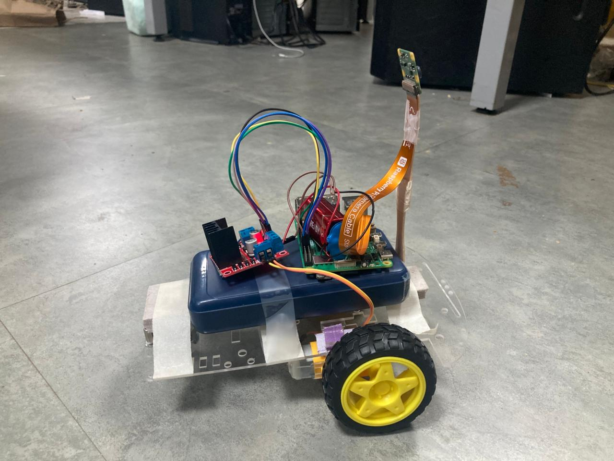 | 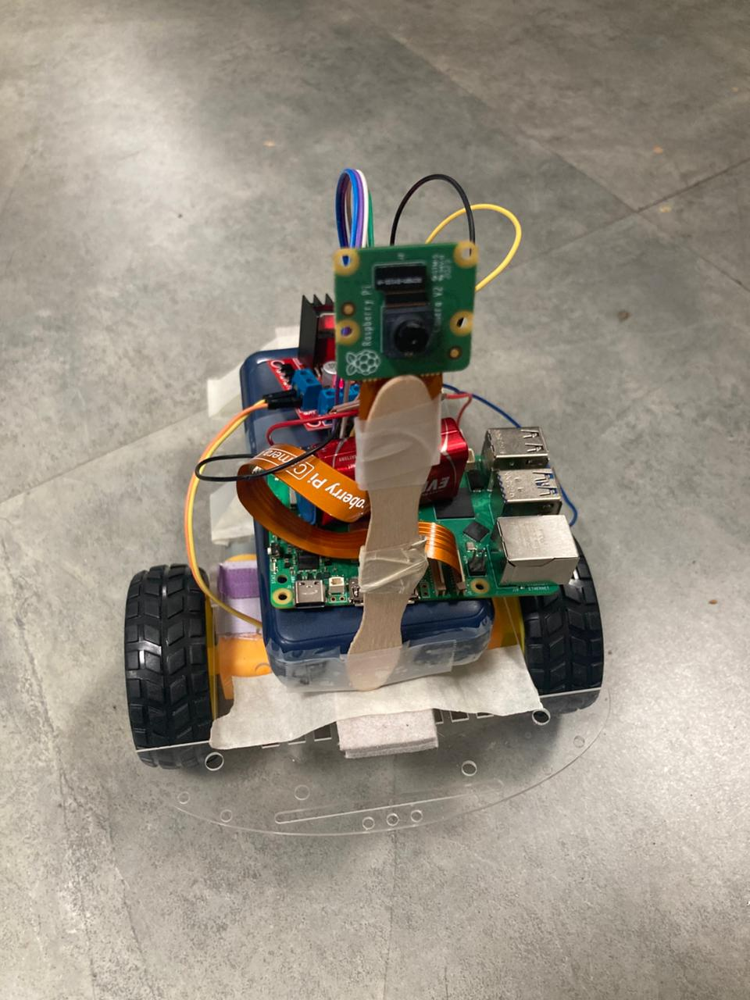 |
|:---:|:---:|
| *Figure 17a: Assembled car (side view)* | *Figure 17b: Assembled car (rear view)* |

  
*Figure 17c: Assembled car (front view)*

### 9.2 Pin Reference Diagrams

  
*Figure 18: Raspberry Pi 5 GPIO pinout (BCM numbering)*

  
*Figure 19: L298N motor driver pinout*

  
*Figure 20: PWM signal — duty cycle controls motor speed*

### 9.3 Gesture Detection Screenshots

|  |  |
|:---:|:---:|
| *Figure 21a: FIST detected — motors DRIVE* | *Figure 21b: OPEN PALM detected — motors STOP* |

|  |  |
|:---:|:---:|
| *Figure 21c: THUMB LEFT — motors SPIN LEFT* | *Figure 21d: THUMB RIGHT — motors SPIN RIGHT* |

|  |  |
|:---:|:---:|
| *Figure 21e: NO HAND — safe STOP default* | *Figure 21f: UNKNOWN — safe STOP default* |

### 9.4 Performance Monitoring

|  |  |
|:---:|:---:|
| *Figure 22a: Task Manager — No Hand state* | *Figure 22b: Task Manager — Open Palm state* |

### 9.5 Hand Landmark Reference

  
*Figure 23: MediaPipe 21 hand landmarks with numbered joints. Red dashed line shows palm size measurement (lm0 → lm9) used for scale-invariant gesture classification.*

### 9.6 Pruning Output

  
*Figure 24: Terminal showing pruning script crash — ValueError due to weight count mismatch*

---

## 10. Conclusions & Limitations

### 10.1 Key Outcomes

This project successfully demonstrated a fully functional gesture-controlled toy car running entirely on edge hardware. The Raspberry Pi 5 handled real-time MediaPipe hand landmark inference at ~25–29% CPU utilization, leaving substantial headroom for additional processing. Four gestures (Fist, Open Palm, Thumb Left, Thumb Right) were reliably mapped to four motor actions (Forward, Stop, Spin Left, Spin Right) through a debounced, rule-based classifier. The camera provided usable hand detection at distances up to 3 meters. The system operated fully offline with no cloud dependency, achieving the core objectives of low-latency, privacy-preserving edge AI deployment.

Additionally, a **Flask-based web streaming interface** was successfully implemented, allowing remote monitoring of the gesture car via any device on the same WiFi network. The multi-threaded architecture ensured that motor control remained unaffected by streaming latency, with motors responding in ~126 ms while the web display showed ~200–300 ms delay due to MJPEG encoding and WiFi transfer.

### 10.2 Limitations

- **Rule-based classifier rigidity:** The geometric threshold approach works well for the four defined gestures but cannot easily scale to additional gestures without manual threshold tuning.

- **Single-hand, single-user:** The system is configured for `num_hands=1`. Multiple hands in the frame would cause undefined behavior.

- **No speed modulation:** Motor speed is fixed at 70% (forward) and 60% (turns). No proportional control based on hand position.

- **Web streaming display latency:** The MJPEG stream adds ~200–300 ms of visual delay. This is a fundamental protocol limitation over WiFi.

- **Pruning not successfully applied:** The model compression experiment failed due to a weight dimension mismatch. The pruned model was never deployed.

- **Camera orientation fixed:** The user must position their hand within the camera's field of view.

- **Power management:** No battery voltage monitoring is implemented.

---

## 11. Future Work

- **WebRTC streaming:** Replace MJPEG with WebRTC for sub-50 ms streaming latency.

- **Replace rule-based classifier with a trained CNN:** Collect a real gesture dataset (500+ images per class), train the MobileNetV2 head with proper pruning, and deploy the pruned TFLite model.

- **Proportional speed control:** Use hand distance from camera (estimated from palm size) to modulate motor PWM duty cycle.

- **Add more gestures:** Introduce gestures for reverse, variable speed, and emergency stop (both hands).

- **Add obstacle avoidance:** Integrate an ultrasonic sensor (HC-SR04) for autonomous obstacle detection.

- **Battery monitoring:** Add an ADC (e.g., ADS1115) to monitor battery voltage and provide low-battery warnings.

- **Two-hand gesture support:** Enable `num_hands=2` for more complex control schemes.

- **INT8 quantization:** Apply post-training quantization to further reduce model size and inference latency.

---

## 12. Challenges & Mitigation

### Challenge 1: DNS Resolution Failure on Raspberry Pi

**Problem:** The Raspberry Pi could not resolve domain names (`ping google.com` → "Temporary failure in name resolution") despite having a valid WiFi IP address (10.48.195.158) and being able to reach external IPs (`ping 8.8.8.8` succeeded).

**Cause:** The campus network's local DNS server (10.48.195.37) was not responding reliably.

**Mitigation:** Manually added Google's public DNS servers to `/etc/resolv.conf` (`nameserver 8.8.8.8`, `nameserver 8.8.4.4`) and restarted NetworkManager.

### Challenge 2: NumPy Binary Incompatibility

**Problem:** `ValueError: numpy.dtype size changed, may indicate binary incompatibility. Expected 96 from C header, got 88 from PyObject`.

**Cause:** System `picamera2` and `simplejpeg` were compiled against NumPy 1.x. Installing NumPy 2.4.4 via pip caused ABI mismatch.

**Mitigation:** Downgraded NumPy: `pip install numpy==1.24.3`.

### Challenge 3: Virtual Environment Cannot See System Packages

**Problem:** `ModuleNotFoundError: No module named 'picamera2'` despite system-wide installation.

**Cause:** Virtual environment created without `--system-site-packages`.

**Mitigation:** Recreated venv: `python3 -m venv --system-site-packages venv`.

### Challenge 4: libcap Development Headers Missing

**Problem:** `pip install opencv-python` failed: "You need to install libcap development headers."

**Mitigation:** `sudo apt-get install -y libcap-dev python3-dev`.

### Challenge 5: Web Streaming Color Space Confusion

**Problem:** Flask version failed to detect hands despite same camera and lighting as working script.

**Cause:** Early Flask version skipped `cv2.cvtColor(frame, cv2.COLOR_BGR2RGB)` before MediaPipe.

**Mitigation:** Copied exact frame processing pipeline from `gesture_car-2.py`.

### Challenge 6: Motor Wiring Mismatch Between Scripts

**Problem:** Flask script used incorrect motor wiring (`Motor(forward=17, backward=18)`) — missing `backward=27` and `enable=18, pwm=True`.

**Mitigation:** Matched motor initialization exactly to `gesture_car-2.py`: `Motor(forward=17, backward=27, enable=18, pwm=True)`.

### Challenge 7: Pruning Weight Mismatch Error

**Problem:** `ValueError: set_weights() expected 270 weights but received 264`.

**Cause:** TFMOT's `prune_low_magnitude()` wrapper adds 6 internal pruning variables per Dense layer.

**Mitigation:** Identified fix (layer-by-layer transfer or pruning before training). Not deployed due to time constraints.

### Challenge 8: Thumb Direction Ambiguity

**Problem:** Near-vertical thumb alternated between LEFT, RIGHT, and UNKNOWN.

**Mitigation:** Debounce filter (3–5 frames) + angular threshold `abs(dx) > abs(dy) * 0.8`.

### Challenge 9: Common Ground Issue

**Problem:** Erratic motor behavior — motors spinning at wrong speeds or not responding.

**Mitigation:** Connected all three grounds (Pi GND + L298N GND + Battery GND) together.

### Challenge 10: Web Streaming Latency

**Problem:** Flask MJPEG stream exhibited ~200–300 ms visual delay.

**Cause:** Inherent to MJPEG-over-WiFi: JPEG encoding + WiFi transfer + browser rendering.

**Mitigation:** Multi-threaded architecture, frame resizing (640×480 → 320×240), low JPEG quality (30–50), no-cache HTTP headers. Accepted remaining latency as protocol limitation. Motor control unaffected.

---

## 13. References

1. Google MediaPipe Hand Landmarker documentation: https://developers.google.com/mediapipe/solutions/vision/hand_landmarker
2. MediaPipe Hand Landmark model card: https://storage.googleapis.com/mediapipe-assets/Model%20Card%20Hand%20Tracking%20Lite%20MediaPipe.pdf
3. TensorFlow Model Optimization Toolkit (TFMOT) — Pruning guide: https://www.tensorflow.org/model_optimization/guide/pruning
4. Raspberry Pi 5 GPIO documentation: https://www.raspberrypi.com/documentation/computers/raspberry-pi.html
5. Picamera2 library documentation: https://datasheets.raspberrypi.com/camera/picamera2-manual.pdf
6. gpiozero Motor class documentation: https://gpiozero.readthedocs.io/en/stable/api_output.html#motor
7. L298N motor driver datasheet: https://www.st.com/resource/en/datasheet/l298.pdf
8. MobileNetV2 — Sandler, M. et al., "MobileNetV2: Inverted Residuals and Linear Bottlenecks," CVPR 2018.
9. OpenCV Python documentation: https://docs.opencv.org/4.x/
10. TensorFlow Lite XNNPACK delegate: https://www.tensorflow.org/lite/performance/xnnpack
11. Flask Web Framework: https://flask.palletsprojects.com/
12. MJPEG streaming with Flask: https://blog.miguelgrinberg.com/post/video-streaming-with-flask

---

*End of Report*
